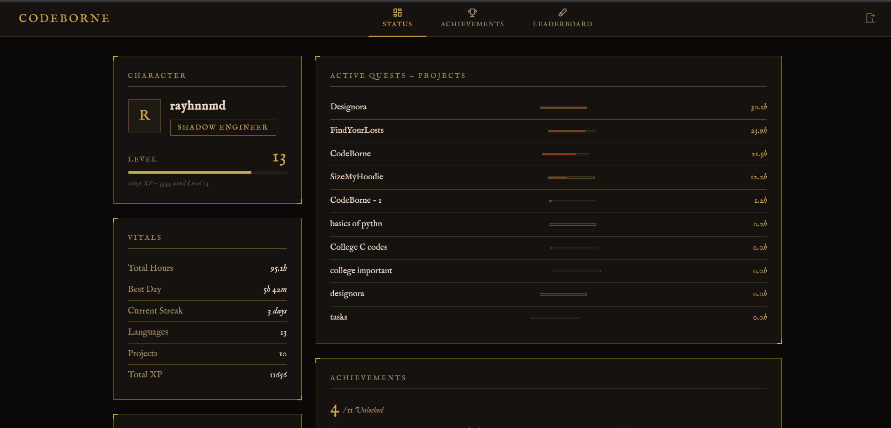
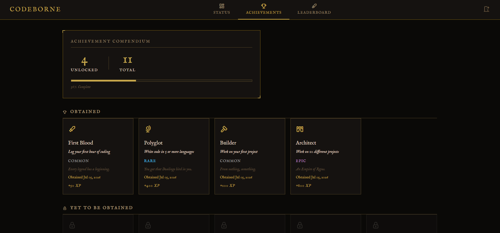
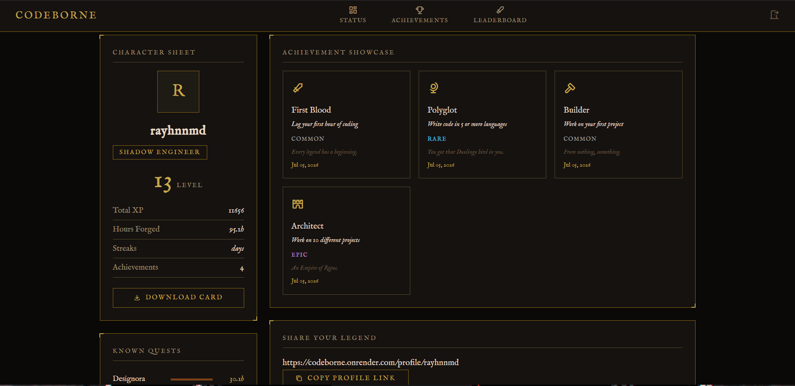
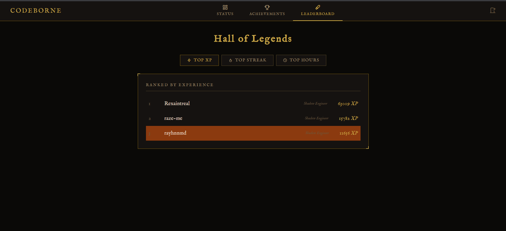

# CodeBorne

Your coding hours, forged into legend.

CodeBorne transforms your [Hackatime](https://hackatime.hackclub.com) coding stats into a Dark Souls-inspired RPG progression system. Every hour you code becomes XP. Every milestone unlocks an achievement. Your grind has a rank now.


---

## Deployement Link and Video

[CodeBorne](https://codeborne.onrender.com)     and     [Demo Video](https://drive.google.com/file/d/1EvMWUfe-9wMBEYjbqa6LLre_wc0pJXCV/view?usp=drivesdk)

---

## Screenshots

| Dashboard | Achievements |
|---|---|
|  |  |

| Profile | Leaderboard |
|---|---|
|  |  |

---

## Features

- **RPG Progression** - your total coding hours convert to XP, levels, and rank titles (Novice Coder → Mythic Overlord)
- **Achievement System** - 11 achievements across 4 rarity tiers that unlock based on your real coding activity
- **Project Tracking** - every project you've worked on shown with hours spent and a progress bar
- **Leaderboard** - compete globally by XP, streak, or total hours
- **Public Profiles** - shareable profile page showing your rank, stats, and achievement showcase
- **Shareable Card** - download a PNG card of your character stats to flex on Discord
- **Dark Souls UI** - IM Fell English font, gold accents, aged panel borders, locked achievement fog

---

## How It Works

1. Log in with your Hackatime account via OAuth
2. CodeBorne fetches your coding stats such as total hours, streak, languages, projects
3. Your stats are converted into XP, a level, and a rank
4. Achievements unlock automatically based on your activity
5. Check back as you code more with new achievements pop as you hit milestones

---

## Tech Stack

- **Backend** - Flask, Flask-SQLAlchemy, Flask-Login, Flask-Migrate
- **Database** - SQLite
- **Auth** - Hackatime OAuth 2.0
- **Frontend** - Jinja2, vanilla CSS, vanilla JS
- **Icons** - Tabler Icons
- **Font** - IM Fell English (Google Fonts)
- **Card Export** - Pillow

---

## Self-Hosting

```bash
git clone https://github.com/rayhnnmd/CodeBorne
cd CodeBorne

python3 -m venv venv
source venv/bin/activate    # Windows: venv\Scripts\activate
pip install -r requirements.txt
```

Create a `.env` file:

```
SECRET_KEY=your_secret_key
DATABASE_URL=sqlite:///codeborne.db
HACKATIME_CLIENT_ID=your_client_id
HACKATIME_CLIENT_SECRET=your_client_secret
HACKATIME_REDIRECT_URI=http://localhost:5000/auth/callback
```

Run migrations and start:

```bash
python -m flask db upgrade
python -m flask run
```

You'll need a Hackatime OAuth app registered at [hackatime.hackclub.com](https://hackatime.hackclub.com) with `profile read` scopes.

---

## Achievements

| Name | Rarity | Condition |
|---|---|---|
| First Blood | Common | Log your first hour |
| Builder | Common | Work on your first project |
| Grinder | Rare | Hit 100 total hours |
| No Lifer | Rare | Code 8 hours in a single day |
| Unbroken Flame | Rare | Maintain a 7-day streak |
| Polyglot | Rare | Use 5 or more languages |
| Addicted | Epic | Hit 500 total hours |
| Discipline | Epic | Maintain a 30-day streak |
| Architect | Epic | Work on 10 projects |
| Archmage | Legendary | Reach 100 total hours |
| Ghosted | Common | Disappear for 7 days (shame achievement) |

---

